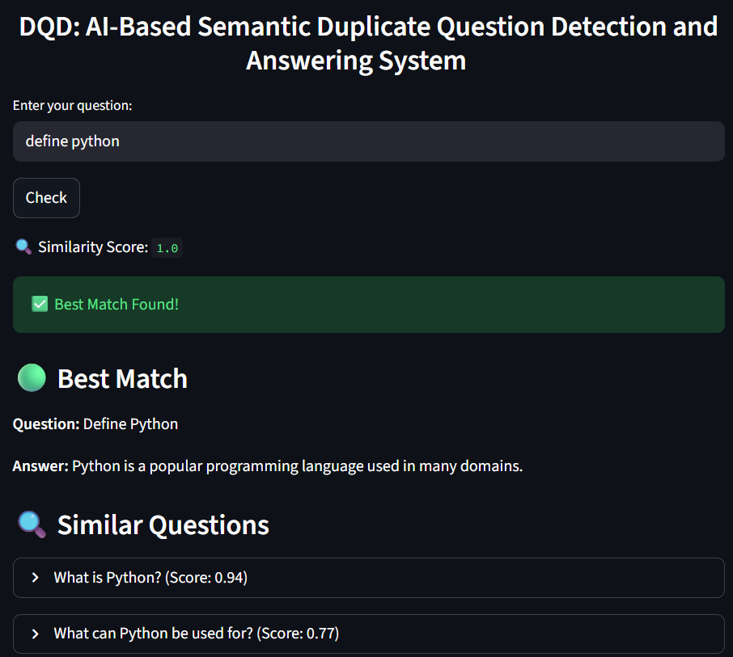
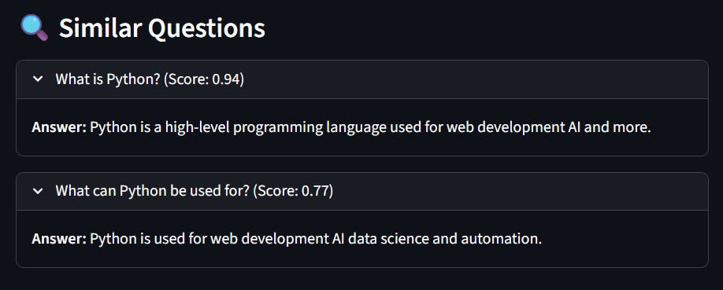

# DQD: Duplicate Question Detection System

## Overview
An AI-based system to detect semantically similar questions and prevent duplicate queries using embeddings and cosine similarity.

## Tech Stack
- Python  
- Streamlit  
- Sentence Transformers  
- NLP  
- Cosine Similarity  
- Gemini API  

## Features
- Detect similar questions  
- Suggest related questions  
- Generate answers using AI  
- Improve efficiency of question-answer systems  

## Screenshots

### Question Answer Page


### Duplicate Detection


## How to Run

1. Install dependencies:

```pip install -r requirements.txt```

2. Run the application:
```streamlit run app.py```

## Author
Dikshita Bargoda